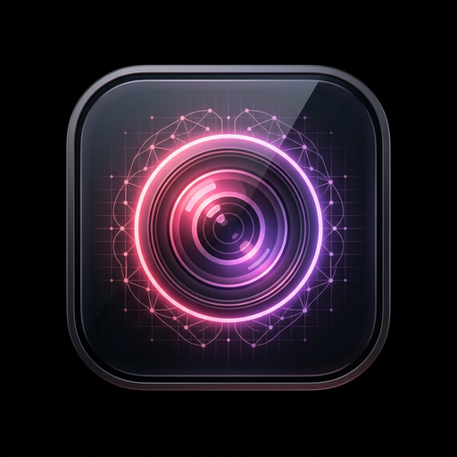
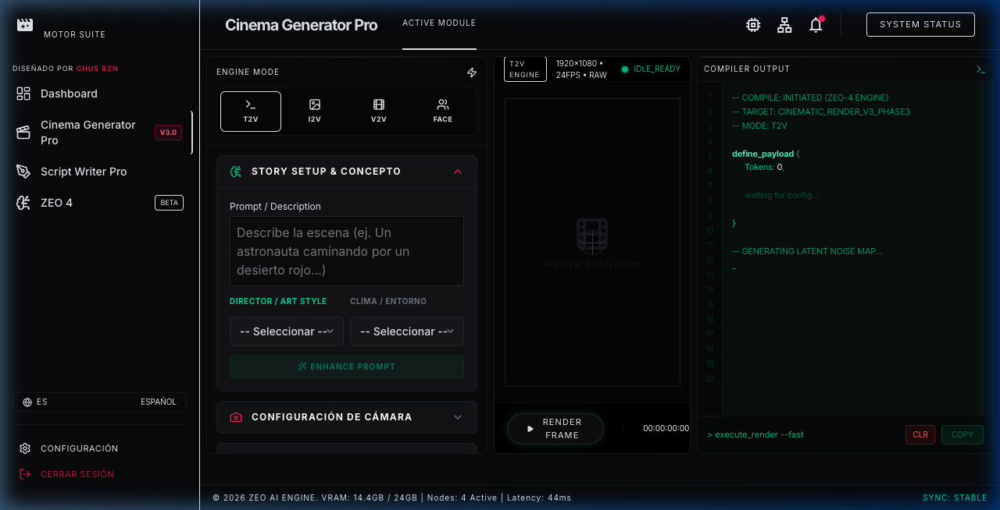

  

<h1 align="center">Studio Pro Suite V1.0.0</h1>

  <b>The Ultimate AI Cinematic Creation & Parametric Camera Automation Ecosystem</b> 
  <i>El Ecosistema Definitivo de Creación Cinematográfica IA y Automatización de Cámara Paramétrica</i>

  
  
  
  

🌐 **Читать на:** [🇬🇧 English](README.md) | [🇪🇸 Español](README_es.md) | [🇩🇪 Deutsch](README_de.md) | **🇷🇺 Русский** | [🇯🇵 日本語](README_ja.md) | [🇺🇦 Українська](README_uk.md) | [🇨🇳 中文](README_zh.md)

---

## 🎯 Видение

Непоследовательность - величайший враг в генеративных моделях. Studio Pro Suite разработана как автоматизированный 'Script Supervisor'. Нашей инженерной целью было изолировать детерминированные переменные и заставить их работать как неизменные директивы. Результат - строгий эстетический компилятор для идеальной кинематографической непрерывности.

> [!NOTE]
> Developed by **produktes-code** and **Jesús Ferrer (CHUS BZN)** to establish professional standards in commercial engineering.

---

## 📸 Interface / Ergonomics

---

## ⚙️ Мастер-класс параметров

- **Детерминированное оборудование**: Выбор 'IMAX' вызывает компрессию кадра и глубину резкости 70-мм пленки.
- **Инъекция авторства**: Симулирует стиль гениев кино (например, Wes Anderson для симметрии).
- **Строгий контроль соотношения сторон**: Изменяет геометрическую композицию модели.
- **Script Writer Pro**: База данных для сохранения непрерывности между кадрами.
- **ZEO-4 TTS**: Преобразует текст в озвучку с естественной интонацией.

---

## 🛡️ Архитектура экранирования

Экранирование:

• Anti-Flood: Блокировка всплесков запросов.
• Magic Bytes: Гексадецимальная проверка файлов.
• 2 GB Limit: Защита оперативной памяти.

---

## 🚀 Техническое развертывание и установка CI/CD

Чтобы гарантировать абсолютную математическую точность и сохранить нашу архитектуру Python DSP без ущерба для кроссплатформенности, мы теперь используем **Автоматизированный CI/CD через GitHub Actions**.
Вместо локальной сборки `.exe` наш исходный код компилируется нативно в чистых облачных средах Windows и macOS.

#### Как скачать и установить
1. Перейдите в раздел **[Releases](https://github.com/produktes-code/Studio-Pro-Suite/releases)** этого репозитория.
2. Загрузите последнюю автоматизированную сборку для вашей ОС:
   - `Studio Pro Suite Setup.exe` (Windows)
   - `Studio Pro Suite.dmg` (macOS)

### 🍎 Пользователи macOS (Gatekeeper)
Из-за отсутствия платного сертификата разработчика Apple, Gatekeeper поместит бинарный файл в карантин. Законный локальный обход: **Правый клик по приложению -> Открыть** (не двойной клик). Это стандартный процесс для open-source.

### 🪟 Пользователи Windows (SmartScreen)
Windows Defender может показать синий экран 'Система Windows защитила ваш компьютер'. Нажмите **'Подробнее'**, а затем **'Выполнить в любом случае'**.

## 📚 Документация и руководства

Загрузите наше официальное руководство:

📥 **[USER_MANUAL.pdf (PDF - 7 Languages)](docs/USER_MANUAL.pdf)**

---

## ⚖️ Инженерный манифест

Разработано produktes-code и Jesus Ferrer (CHUS BZN). CC BY-NC-SA 4.0. CORPORATE STANDARD.

